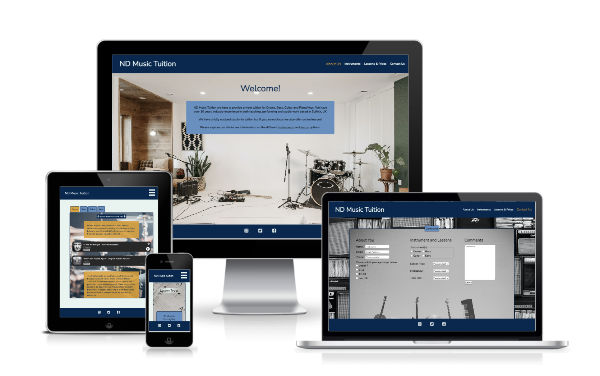
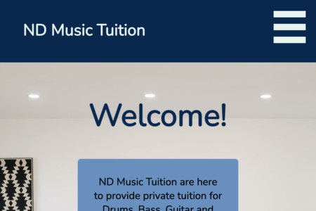
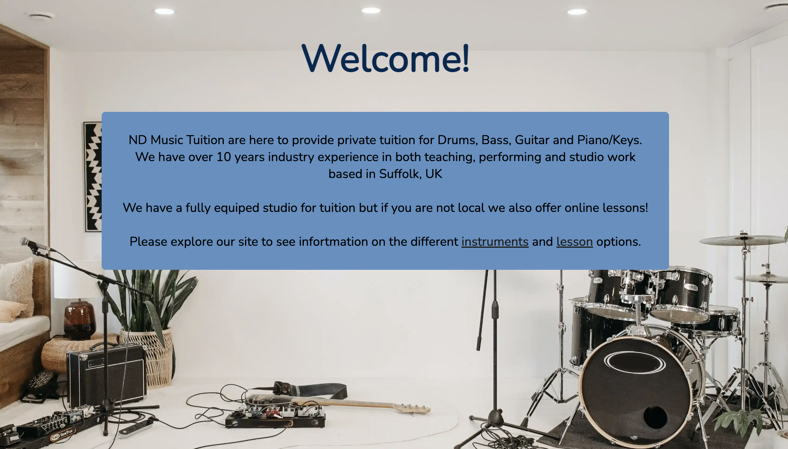
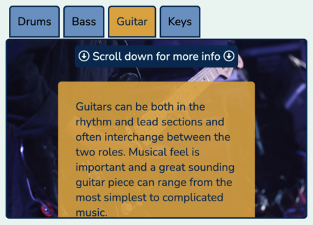
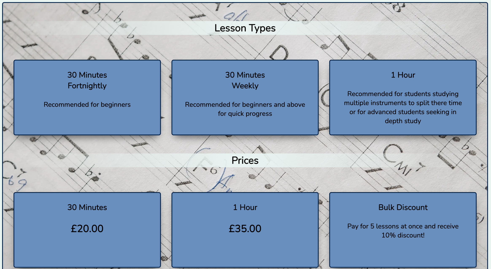
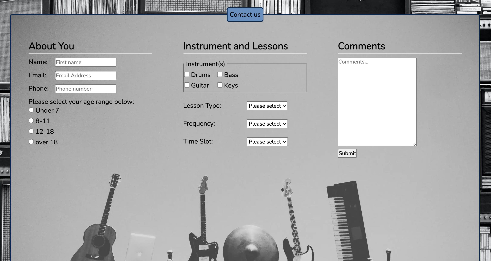
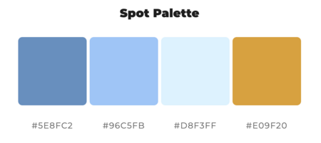
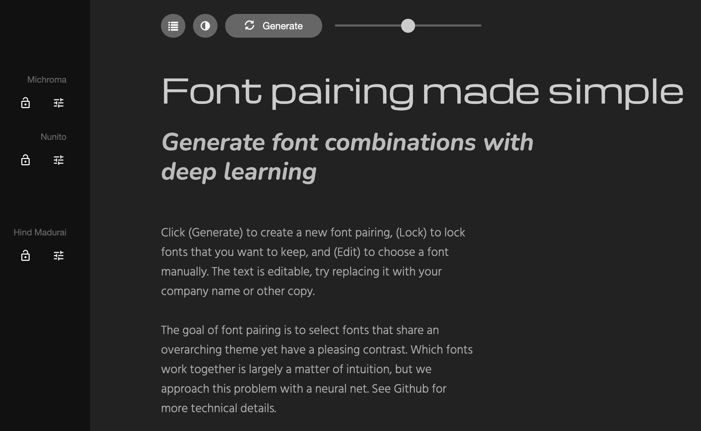
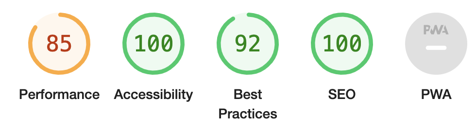

# ND Music Tuition

ND Music Tuition is a provider of private music lessons for Drums, Bass, Guitar, and Piano. The target audience is people of all ages and background who wish to learn or develop existing musical skills.

The intent of the  website is to inform the visitor of who ND Music Tuition is and the services they offer. Also to direct them to further information to explore different instruments and how to get started.

## Tabel of Contents
+ [Features](#features "Features")
  + [Existing Features](#existing-features "Existing Features")
+ [Design](#design "Design")
  + [Colour Scheme](#colour-scheme "Colour Scheme")
  + [Typography](#typography "Typography")
  + [Imagery](#imagery "Imagery")
  + [Media](#media "Media")
+ [Testing](#testing "Testing")
  + [Functional Testing](#functional-testing "Functional Testing")
  + [Usability Testing](#usability-testing "Usability Testing")
  + [Validator Testing](#validator-testing "Validator Testing")
  + [Unfixed Bugs](#unfixed-bugs "Unfixed Bugs")
+ [Technologies Used](#technologies-used "Technologies Used")
  + [Main Languages Used](#main-languages-used "Main Languages Used")
+ [Deployment](#deployment "Deployment")
+ [Credits](#credits "Credits")
  + [Content](#content "Content")
  + [Media](#media "Media")

## Features

### Existing Features
#### Navigation bar:
- The navigation bar is present at the top of each page and is fixed there for easy navigation accross all pages. This is to allow the user explore the site by clicking directly to the section that interests them with out have to follow a direct user path.

- There is a hamburger nav bar for smaller screen sizes to maximise screen space for page content.

#### Landing Page:
- The landing page features a full background image of a music studio to relay a clear website purpose to the user.
- The purpose of this page is to clearly welcome the user and briefly explain the services offer and the extent of the experience of the service provider.

#### Instruments Page:
- The section provides information about the different instrument options that are available for lessons.
- The details are designed to inspire a prospective student and direct them to resources so they can start looking into options to start their journey.
- This section is represented as a resource section with tabs at the top to flip between instruments.

#### Lessons & Pricing Page:
- To present simple stucture of lesson options to perspective students.

#### Contact Page:
- Provide an easy to use contact form which can then be used to gather basic information about the enquiry.
- Only the 'About You' Section of the form is mandatory to allow for easy completion incase the user does not wish to complete full form.

#### Social Links:
- At the bottom of every page is a fixed footer with links to main social media pages for the user to explore.

### Future Features:
- Add further information in the 'About Us' section to include more about the learning studio and technologies used to provide effective online tuition.
- Add further links to lead the user to advance the user path, for instance a link to the 'Contact Us' section in the lessons and prices to prompt the user.
- Obtain testimonials to showcase services offered.

## Design

### Colour Scheme:
- A modern colour scheme was chosen, with an accent colour to enable elements to be highlighted. 
- The colour scheme was generated from https://mycolor.space/

### Typography:
- Michroma was used as the font for the company logo, and Nunito was used as the main font for the rest of the text on the website.
- These fonts where paired using https://fontjoy.com/ and sourced from https://fonts.google.com/

### Imagery:
- All images through out the website were sourced from https://www.pexels.com/ - an open source image site.

### Media:
- All songs are embedded content used from https://open.spotify.com/ 
- All videos are embedded content used from https://www.youtube.com/

## Testing

Throughout the project, when new features were added these were tested in a local server. In doing this any issues where highlighted whilst in the development process to allow for easy adjustments to be made in realtime. Also, checking other pages when implementing changes to address whether indirect changes have occured due to styling on new feature. 

An example of this is when styling the anchor elements on the Instruments section, inadvertently the anchor elements in the navigation were changed as well. As a result, high specificity was used in the CSS styling to overcome this issue. 

### Functional Testing
- The website was deployed through github pages but this presented an issue where only the index page was accessible and background images did not load. When a link was clicked to open another site error code 404 appears.  
Upon investigation, the href and URL links used in the initial build were in the following format **URL(/instruments**.html).  
Although this did not present any issues when viewing on a local server, it did not work when deployed. All links where then changed to this format **URL(instruments.html)** - removing the forward slash at the from of the file path.
- All external links checked to make sure target=_blank was initiated to ensure when user was directed away from the website that the open website stayed in place to encourage the user to return.
- All internal links in navigation checked, and anchor elements within page have desired outcome.
- All embedded media can be called upon efficiently and can be interacted with.
- Form element in 'Contact Us' section checked.
  - Includes required fields and validation on emails
  - Upon form submission, user receives a verification that it was successful.

### Usability Testing
- Main navigation for full screen viewing consistent in display and location across all pages. All links work as expected, including the site name logo linking to the home page on each page.
- Hammer Burger menu for smaller screen sized works appropriately accross all pages. However, if the user does not follow the expected completion path of clicking a link to a new page there is no obvious way to revert the hamburger menu back to it's original state.
- Checked that all Media items and links hold alternatives to aid accessibility.
- Website checked on multiple browsers including chrome, firefox and safari.
- Lighthouse run on each webpage to check for performace, accessibility, best practice and SEO. On initial tests it was found that perforance was low mainly due to large jpeg image files. To help resolve this issue, all images were converted to webp files and over size compressed.  
To further increase loading times on the 'Instruments' page which utilises the use of embedded media, lazy loading was added so that the data was only loaded when actually viewed.  
As a result of the adjustments, the performance on the 'Instruments' page increased from 65% to 85%. Please see details below of lighthouse results.

#### Lighthouse - Instruments Pre-fix

#### Lighthouse - Instruments Post-fix

### Validator Testing
- HTML
  - 1 error shown when passing through the offical [W3C Validator](https://validator.w3.org/nu/?doc=https%3A%2F%2Fndominey.github.io%2FND-Music-Tuition%2F)
   - Nav nested with in Label error due to Hamburger Menu

- CSS
  - No errors found when tested through official [Jigsaw validator](https://jigsaw.w3.org/css-validator/validator?uri=https%3A%2F%2Fndominey.github.io%2FND-Music-Tuition&profile=css3svg&usermedium=all&warning=1&vextwarning=&lang=en)

### Unfixed Bugs

## Technologies Used
### Main Languages Used
- HTML5
- CSS3

## Deployment
- *Provide details*

## Credits

### Content

### Media
